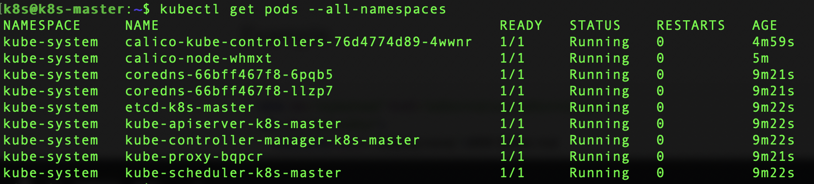

### Letting iptables see bridged traffic

```bash
cat <<EOF | sudo tee /etc/sysctl.d/k8s.conf
net.bridge.bridge-nf-call-ip6tables = 1
net.bridge.bridge-nf-call-iptables = 1
EOF
sudo sysctl --system
```

### install docker
```bash
sudo apt install docker.io
sudo systemctl start docker
sudo systemctl enable docker
```
### Installing kubeadm, kubelet and kubectl
```bash
sudo apt-get update && sudo apt-get install -y apt-transport-https curl
curl -s https://packages.cloud.google.com/apt/doc/apt-key.gpg | sudo apt-key add -
cat <<EOF | sudo tee /etc/apt/sources.list.d/kubernetes.list
deb https://apt.kubernetes.io/ kubernetes-xenial main
EOF
sudo apt-get update
sudo apt-get install -y kubelet kubeadm kubectl
sudo apt-mark hold kubelet kubeadm kubectl
```

### Disable Swap

```bash
sudo swapoff --all
sudo sed -i '/swap/d'  /etc/fstab
```
### Bring Up one node k8s
```bash
sudo kubeadm init
```
Run and save the environment variable
```
  mkdir -p $HOME/.kube
  sudo cp -i /etc/kubernetes/admin.conf $HOME/.kube/config
  sudo chown $(id -u):$(id -g) $HOME/.kube/config
```
Save the join node command
```
kubeadm join 192.168.87.245:6443 --token 8gtpuj.7a3m8y3dp3j5g9jo \
    --discovery-token-ca-cert-hash sha256:e847e6e43b17e2f3abee76738f6fa17612f8c3e8a2823fc392ddd4780892b88
	
```
### Virtual network (we choose calico)
```
kubectl apply -f https://docs.projectcalico.org/v3.14/manifests/calico.yaml
```

### Wait until all pods up and running
```
kubectl get pods --all-namespaces
```



